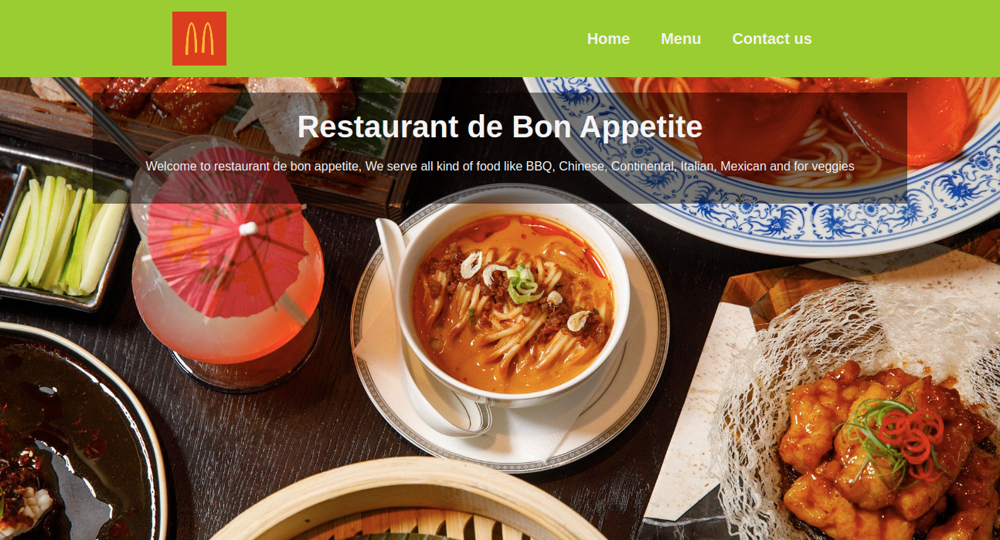

# the-restaurant-page

This is a restaurant page created using webpack and JS ES6. Content on the page is generated using JS only.



## Built With

- javascript
- [webpack](https://webpack.js.org/)
- vscode
- [Bootstrap](https://getbootstrap.com/)
- stylelint
- eslint
- [npm](https://www.npmjs.com/)

# Getting Started

To get a local copy of the repository please run the following commands on your terminal:

```
$ cd <folder>
```

```bash
$ git clone `https://github.com/UmairAhmad125/the-restaurant-page.git`
$ cd the-restaurant-page
$ Open the index.html file using your favorite browser
```
## Live vesion

[Live Demo Link](https://rawcdn.githack.com/UmairAhmad125/the-restaurant-page/53f789a00bc9e7215e2dedee9297c144c264ef5e/dist/index.html)


# Author


👤 **Umair Ahmad**

- Github: [@umairahmad125](https://github.com/UmairAhmad125)
- Linkedin:[Umair Ahmad](https://www.linkedin.com/in/umair-ahmad-b5a89015a/)
- Twitter:[Umair Ahmad](https://twitter.com/umairahmadDP)

## 🤝 Contributing

Contributions, issues and feature requests are welcome!

## Show your support

Give a ⭐️ if you like this project!

## Acknowledgments

- Project inspired by Microverse Program

